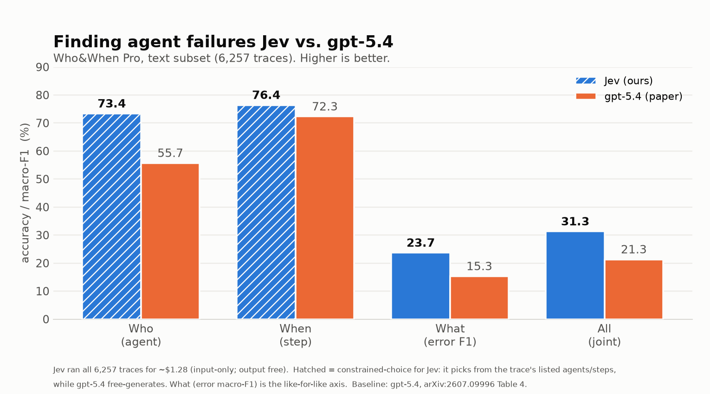

# jev-agent-failure-benchmark

Can a fast, cheap **decision model** find what broke an AI agent as well as a
frontier LLM? This benchmarks [**Jev**](https://typesafe.ai) (Typesafe.ai) on the
text subset of [**Who&When Pro**](https://arxiv.org/abs/2607.09996), an
agent-failure-attribution benchmark: given a failed multi-agent run, predict the
**responsible agent**, the **decisive step**, and the **error type**.

## Result

On all 6,257 text traces, **Jev outperforms GPT-5.4 on every axis — for ~$1.28
total** (Jev bills input only; output tokens are free).



| Model | Who | When | What (error F1) | All |
|---|---|---|---|---|
| **Jev (ours)** | **73.4** | **76.4** | **23.7** | **31.3** |
| gpt-5.4 *(paper)* | 55.7 | 72.3 | 15.3 | 21.3 |

The like-for-like axis is **What** (error type over the same 17-code taxonomy both
sides see): Jev **23.7 vs 15.3**. Jev also leads on joint accuracy (31.3 vs 21.3).
Full numbers and CIs in [`RESULTS.md`](RESULTS.md). Baseline: gpt-5.4,
arXiv:2607.09996 Table 4.

## How it works

Both sides run the same Who&When Pro task. The baselines are the paper's LLM
numbers; Jev is scored on the same subset with the **official `whowhen_eval`
scorer** (pinned commit `14369dcb`), so the rows are directly comparable. Jev
answers three typed `choice` questions per trace — responsible agent, step, error
mode — each returning a calibrated probability distribution.

**Comparability:** Who and When are constrained-choice for Jev (it picks the
agent/step from the trace's listed options; the LLMs free-generate), so the
like-for-like axis is What. Ground-truth labels never enter Jev's input
(`tests/test_leakage.py`).

## Setup

```sh
uv venv && uv pip install -e ".[dev]"
cp .env.template .env      # add TYPESAFE_API_KEY
```

Get the pinned text subset (~72 MB, not redistributed here):

```sh
mkdir -p data
REV=0bd196c8a040841c4ae167ab33cc8151de246f1f
curl -L "https://huggingface.co/datasets/Leoxx/whowhen_pro/resolve/$REV/data/text.jsonl" -o data/text.jsonl
curl -L "https://huggingface.co/datasets/Leoxx/whowhen_pro/resolve/$REV/taxonomy.yaml" -o data/taxonomy.yaml
```

## Run

```sh
# All 6,257 traces (or `sample --n 300` first for a subset). Resumable.
jevbench sample --n 6257 --out results/run/sample.json
jevbench estimate --sample results/run/sample.json     # offline cost estimate
jevbench run --sample results/run/sample.json           # Jev over the sample
jevbench report                                          # metrics + chart + paper comparison
```

`run` sends one trace at a time (bounded concurrency), saves each result to
`results/run/jev/text.jsonl`, resumes on rerun, and records failures rather than
dropping them. `scripts/reproduce.sh` runs the whole flow.

## About the benchmark

Who&When Pro failures are **injected** by a controlled pipeline (replay a
successful run, insert one error), not natural production incidents. This is not
a leaderboard submission. Jev is a "System One" decision model: it takes state
plus typed questions and returns calibrated answers over an allowed set, in one
forward pass, billed on input only.

## Dataset attribution

Who&When Pro, `Leoxx/whowhen_pro`, **CC-BY-4.0**. Liu, Xi, Zhang, Zeng, Yue,
Wang, Kang, Wu, Wang, *"Who&When Pro: Can LLMs Really Attribute Failures in AI
Agents?"*, arXiv:2607.09996 (2026). Harness:
[whowhenpro/whowhen_pro](https://github.com/whowhenpro/whowhen_pro).

## Pilots

- [`pilots/gliclass-routerarena`](pilots/gliclass-routerarena) — a separate
  zero-shot-router pilot on RouterArena (negative result; not Jev).

## License

Code: Apache-2.0. The dataset keeps its own CC-BY-4.0 license and is not included.

## Tests

```sh
pytest -q       # offline; no API keys required
ruff check .    # lint
```
